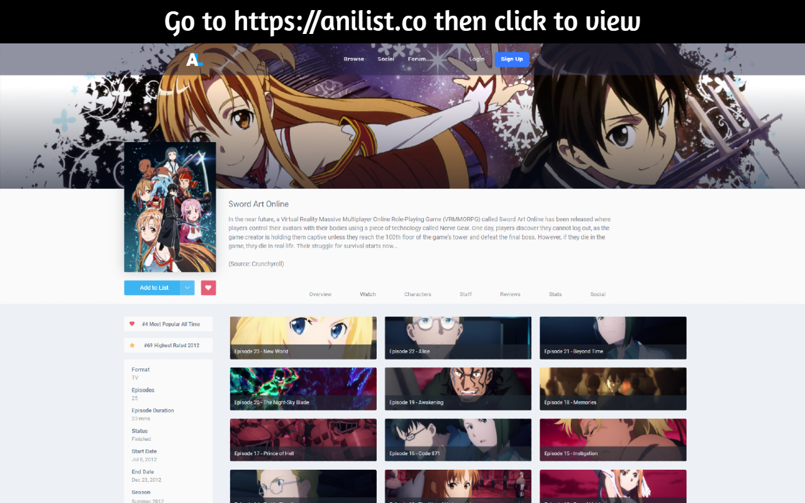
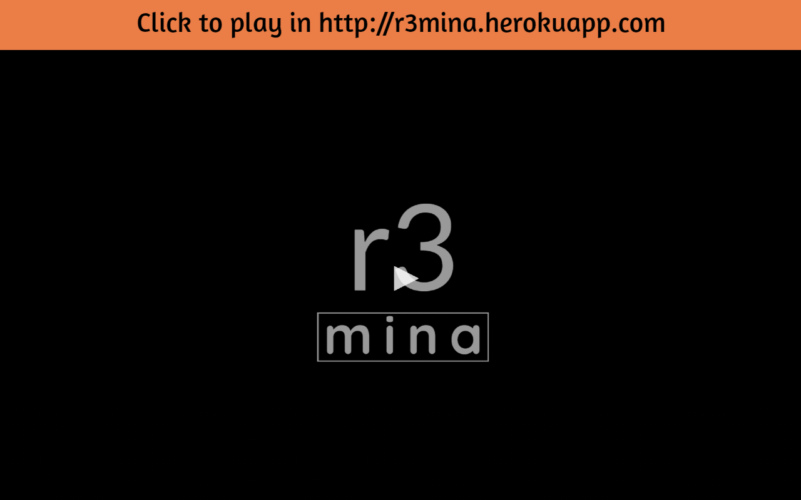
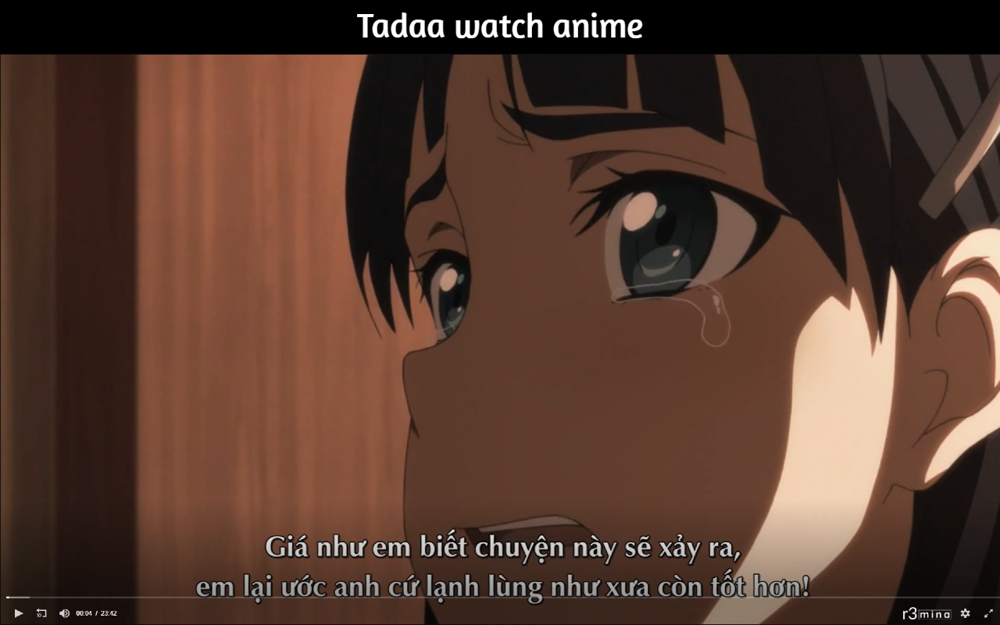

# r🍌
# r3nana
<!--  -->

## Home: http://r3mina.herokuapp.com

## Anime: https://anilist.co/search/anime

## Install
- Open chrome://extensions/ in Chrome
- Turn on Developer mode
- Drag r3nana folder to Chrome
- Go to anilist.co and watch anime

## How to use

## Feature
- [x] View from https://anilist.co watch
- [ ] Merge id and name

# r3ads

## Feature
- [x] Sponsored: Remove sponsored ads
- [x] Suggested: Remove suggested for you
- [x] Activity: Remove friends activities commented and shared
- [x] Shared: Remove shared post
- [x] Black: Remove post contains black list